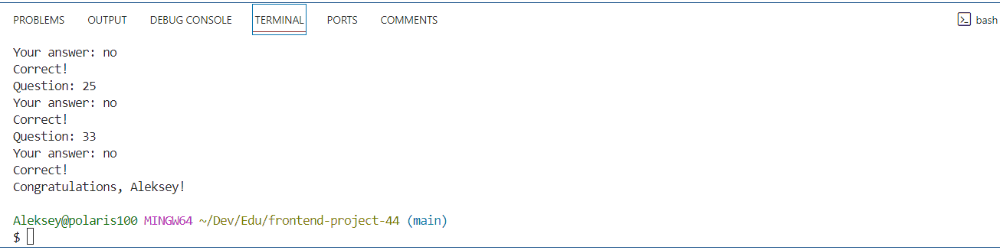

## Brain Games

### Hexlet tests and linter status:

### Code Climate analysis:

---

«Игры разума» — набор из пяти консольных игр, построенных по принципу популярных мобильных приложений для прокачки мозга. Каждая игра задает вопросы, на которые нужно дать правильные ответы. После трех правильных ответов считается, что игра пройдена. Неправильные ответы завершают игру и предлагают пройти ее заново. Игры:

- Калькулятор. Арифметические выражения, которые необходимо вычислить.

- Определение четного числа.

- Определение наибольшего общего делителя.

---
